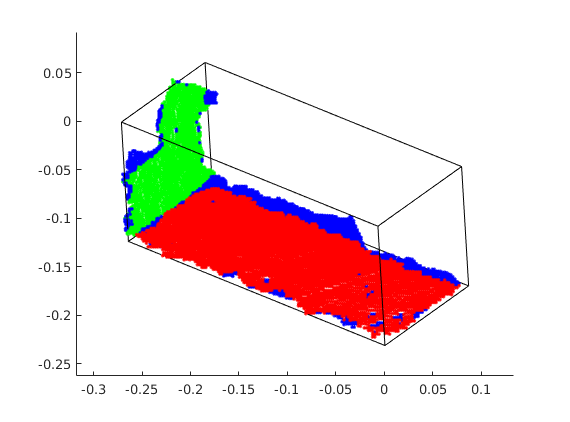
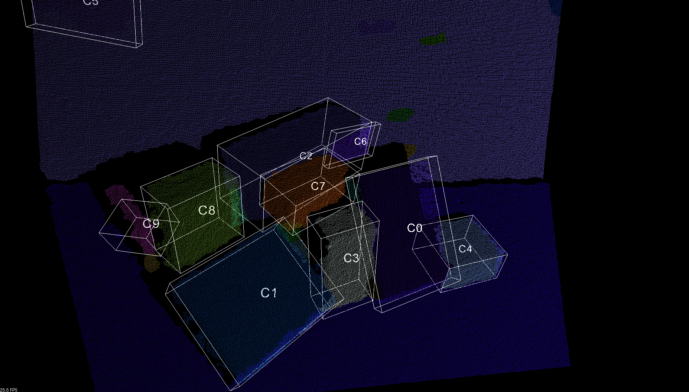

# cub_estimation
Input the 3d pointcloud data and estimate the min boundingbox surrounding the cloud data, and get the size and orientation of cub..

and the result of the program running in c++: 

